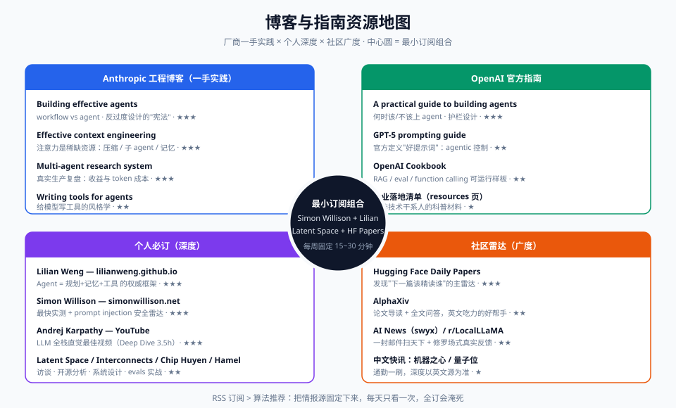

# 03-博客与官方指南

> 论文讲"为什么"，官方博客讲"我们生产环境里怎么做的"。这一份清单是**时效性最好**的情报源：协议演进、工程实践、新基准的第一手消息都先出现在这里。
> 使用建议：★★★ 立即读，★★ 本月内读，★ 收藏备用；每条都附"为什么值得读"。

## 一、Anthropic 工程博客（agent 工程最佳实践的第一产地）

| 文章 | 链接 | 优先级 | 为什么值得读 |
|---|---|---|---|
| Building effective agents | anthropic.com/engineering/building-effective-agents | ★★★ | Agent 设计的"宪法级"短文：区分 workflow 与 agent，倡导"最简单可用的方案"；你所有架构争论的引用源头。十全十美的反过度设计宣言 |
| Effective context engineering for AI agents | anthropic.com/engineering/effective-context-engineering-for-ai-agents | ★★★ | 把"提示工程"升级为"上下文工程"的宣言：注意力是稀缺资源，讲压缩、子agent、记忆分层的工程取舍——与 MemGPT 精读卡互为印证 |
| How we built our multi-agent research system | anthropic.com/engineering/built-multi-agent-research-system | ★★★ | 少见的"真实生产系统复盘"：多 agent 协作的收益、token 成本（约 15 倍）、踩过的坑与教训，读完对多 agent 去魅 |
| Writing tools for agents | anthropic.com/engineering/writing-tools-for-agents | ★★ | 教你"给模型写工具"的风格学：工具描述要像给聪明但不熟你系统的新同事写文档——CTRM 系统接 Agent 时照着抄 |
| Claude Code: best practices | anthropic.com/engineering/claude-code-best-practices | ★★ | 顶尖 coding agent 的官方用法手册：CLAUDE.md、权限设计、工作流编排，可平移到任何 coding agent |

## 二、OpenAI 官方指南

| 文章 | 链接 | 优先级 | 为什么值得读 |
|---|---|---|---|
| A practical guide to building agents | openai.com/business/guides-and-resources（PDF，与 Anthropic 假想敌对照着读） | ★★★ | OpenAI 视角的 agent 构建手册：何时该/不该上 agent、单 agent→多 agent 的演进路径、护栏设计；与 Anthropic 同题文章对读收获最大 |
| GPT-5 prompting guide（Cookbook） | cook.openai.com（cookbook 内搜 "GPT-5 prompt"） | ★★ | 前沿模型的官方 prompting 姿势：agentic 工作流控制、工具调用前置、指令层级——看模型厂商自己怎么定义"好提示词" |
| OpenAI Cookbook（常青资源） | cook.openown.com（正确地址 cook.openai.com） | ★★ | 官方示例代码库：RAG、eval、function calling 的可运行样板，抄来就能跑 |
| A real-world guide to agentic AI（与 Analytics_Vidhya? 无关的官方 PDF 系列） | openai.com 官网 resources 页 | ★ | 企业落地清单式指南，适合给非技术干系人当科普材料 |

## 三、必订阅博客 / 个人

| 来源 | 地址 | 优先级 | 为什么值得读 |
|---|---|---|---|
| Lilian Weng（Lil'Log） | lilianweng.github.io | ★★★ | 前 OpenAI 安全研究 VP。2023 年的 *LLM Powered Autonomous Agents*（Agent = 规划 + 记忆 + 工具）至今是领域最权威综述框架；篇篇论文级密度 |
| Simon Willison | simonwillison.net | ★★★ | LLM 社区最活跃的独立观察者：新模型发布当天就有第一手实测、安全与 prompt injection 的持续跟踪；RSS 必订，英文短文易读 |
| Latent Space | latent.space | ★★★ | Agent 领域头部播客+博客：Anthropic/OpenAI/Replit 等核心工程师访谈，了解"谁在造什么、为什么这么造" |
| Nathan Lambert（Interconnects） | interconnects.ai | ★★ | 开源模型与 RLHF/后训练的最佳分析师：理解"推理模型为什么这么训练"必读 |
| Chip Huyen | huyenchip.com | ★★ | 《AI Engineering》作者：ML 系统设计视角看 agent 评估与基础设施，工程味最浓 |
| Hamel Husain | hamel.dev | ★★ | 评估（evals）方向的实战布道者：带你 30 分钟给 agent 搭第一套 eval，纠正"凭感觉调 prompt" |
| Andrej Karpathy | karpathy.ai / YouTube | ★★★ | 前特斯拉 AI 总监/OpenAI 创始成员：*Deep Dive into LLMs*、*Software 3.0* 等视频是理解 LLM 全栈最好的免费课 |
| Sequoia Capital AI | sequoiacap.com/article/ | ★ | 投资视角看 agent 创业版图，了解产业风向即可 |

## 四、论文快讯与社区（保持"雷达"开机）

| 来源 | 形式 | 优先级 | 为什么值得读 |
|---|---|---|---|
| Hugging Face Daily Papers | huggingface.co/papers | ★★★ | 每天 AI 论文榜单+社区讨论，配 RSS/邮件订阅；发现"下一篇该精读谁"的主雷达 |
| AlphaXiv / arXiv cs.CL | alphaxiv.org | ★★ | 论文 + AI 生成导读 + 全文问答，英文阅读吃力时的好帮手 |
| AI News (swyx & friends) | news.smol.ai | ★★ | 每日/每周 AI 情报简报，一条邮件扫完天下事 |
| Reddit r/LocalLLaMA + X/Twitter AI 圈 | reddit.com/r/LocalLLaMA | ★★ | 修罗场式实测反馈：营销讲完之后，真实用户在这说缺点 |
| WeChat 公众号：机器之心 / 量子位 | — | ★ | 中文快讯，通勤时扫一刷，正文深度以英文源为准 |

**订阅策略建议**：全订会淹死。最小可行组合 = Simon Willison（RSS）+ Lilian Weng（出新读新）+ Latent Space（播客通勤听）+ HF Daily Papers（每周一扫）+ 一份中文快讯。每周固定 15~30 分钟。
