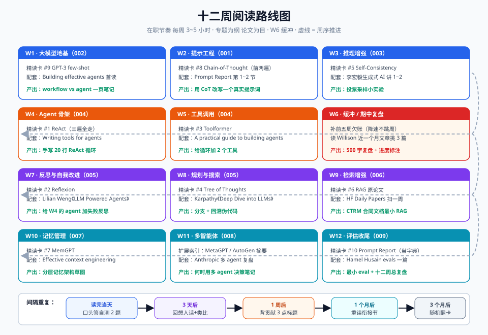

# 05-阅读路线图

> 十二周把"必读十篇 + 核心博客 + 一门课"跑完，且每周的内容都指向 001~010 的某个专题。节奏按"在职、每周可投入 3~5 小时"设计；忙就降速周（每周至少保住精读卡第二遍），不要跳周。

## 一、总原则

1. **专题为纲，论文为目**：每周先打开对应 001~010 专题目录看代码/笔记，再读配套论文——带着"我要解决什么"去读，留存率翻倍。
2. **一张卡三遍走**：每周 1~2 篇精读卡按三遍阅读法走完（第一遍判断 → 第二遍做卡 → ★★★ 论文加第三遍实现视角）。
3. **不追新**：十二周内只读本计划内的材料；路上刷到的新论文记进 `02-扩展论文索引.md` 的待读清单，别拐弯。

## 二、十二周计划

| 周 | 主题（对应专题） | 精读卡 | 配套阅读 | 产出 |
|---|---|---|---|---|
| W1 | 大模型地基（002 大模型基础） | #9 GPT-3 few-shot | Anthropic《Building effective agents》先读一遍做背景 | GPT-3 卡 + "workflow vs agent"一页笔记 |
| W2 | 提示工程入门（001 提示工程） | #8 CoT（第一遍+第二遍） | Prompt Report 第 1~2 节分类框架 | CoT 卡 + 把 CoT 用到你自己的一个提示词里 |
| W3 | 推理增强（001/003） | #5 Self-Consistency | 李宏毅生成式 AI 第 1~2 讲（补直觉） | SC 卡 + 一个"投票采样"小实验 |
| W4 | Agent 骨架（004 Agent 框架） | #1 ReAct（三遍全走） | Anthropic《Writing tools for agents》 | ReAct 卡 + 手写 20 行的 ReAct 循环 |
| W5 | 工具调用（004 工具调用） | #3 Toolformer | OpenAI《A practical guide to building agents》 | Toolformer 卡 + 给你的循环加 2 个工具 |
| W6 | **缓冲周 / 期中复盘** | — | 补前五周欠账；读 Simon Willison 近一个月文章挑 3 篇 | 十二周路线图上标出进度；写 500 字复盘 |
| W7 | 反思与自我改进（005 反思） | #2 Reflexion | Lilian Weng《LLM Powered Autonomous Agents》 | Reflexion 卡 + 给 W5 的 agent 加"失败反思" |
| W8 | 规划与搜索（005 推理增强） | #4 ToT | Karpathy《Deep Dive into LLMs》（3.5h，拆两半看） | ToT 卡 + 一段"分支+回溯"伪代码 |
| W9 | 检索增强（006 RAG） | #6 RAG | HF Daily Papers 扫一周，收藏 RAG 相关 3 篇进扩展索引 | RAG 卡 + 给 CTRM 合同/法规文档搭最小 RAG demo |
| W10 | 记忆管理（007 记忆） | #7 MemGPT | Anthropic《Effective context engineering》 | MemGPT 卡 + 画出你的 agent 分层记忆草图 |
| W11 | 多智能体（008 多智能体） | （无精读卡） | 扩展索引：MetaGPT / AutoGen 各读摘要与架构图；Anthropic 多 agent 复盘 | 一页"什么时候用多 agent"决策笔记 |
| W12 | 评估与收尾（009 评估） | #10 Prompt Report（当字典查） | Hamel Husain evals 一篇；给前 11 周的 demo 补一个最小 eval | 十二周总复盘 + 待读清单（扩展索引 ★ 未读项） |

> 说明：多智能体与评估的精读卡留给将来补写——这两块演进最快，先读官方工程复盘（W11/W12 的配套阅读）比读半年前的论文更有价值。

## 三、每周节奏模板（3~5 小时）

| 时段 | 时长 | 做什么 |
|---|---|---|
| 周一晚 | 30 min | 第一遍：本周论文的摘要+图1+精读卡"一句话/类比/贡献"三节 |
| 周三晚 | 90 min | 第二遍：通读原文，在精读卡上补批注；卡壳就查 04 清单里的课程对应章节 |
| 周末 | 60~120 min | 第三遍（仅 ★★★ 论文）+ 动手产出（表格右列）+ 复习上周卡片 |

## 四、间隔重复计划（防遗忘）

精读卡是现成的复习卡片，复习策略如下：

| 时间点 | 动作 |
|---|---|
| 读完当天 | 只答每张卡最后的"自测 2 题"，口头作答 |
| 读后 3 天 | 翻开卡，只看"一句话人话 + 生活类比"，回忆关键实验数字（说不出再翻数据节） |
| 读后 1 周 | 用 Anki/手写自测：每篇论文背出"贡献 3 点的标题"；不熟的标黄 |
| 读后 1 个月 | 只复习标黄的卡 + 把"与 001~010 的衔接"重读一遍，检查专题代码里是否用上了 |
| 读后 3 个月 | 抽 10 分钟随机翻卡；此时你应能对任何一篇讲出"它解决什么、被谁超越、思想活在今天哪个系统里" |

**自测验收线**：十二周结束时，拿 `papers/README.md` 索引表遮住"一句话"列，能全部复述 = 合格；能对 ReAct/CoT/RAG 任一篇画出轨迹/流程图 = 优秀。

## 五、超过十二周之后

1. 把 `02-扩展论文索引.md` 中 ★★ 以上未读项按同样节奏排下一轮（建议 6 周一轮，每周 1 篇）。
2. 订阅清单（03 文件）转入常态维护：每周 15~30 分钟，发现好文章回填索引表。
3. 新基准/新技术（MCP 生态、推理模型）以官方博客为准，论文滞后于实践——这是 Agent 领域的常态。
